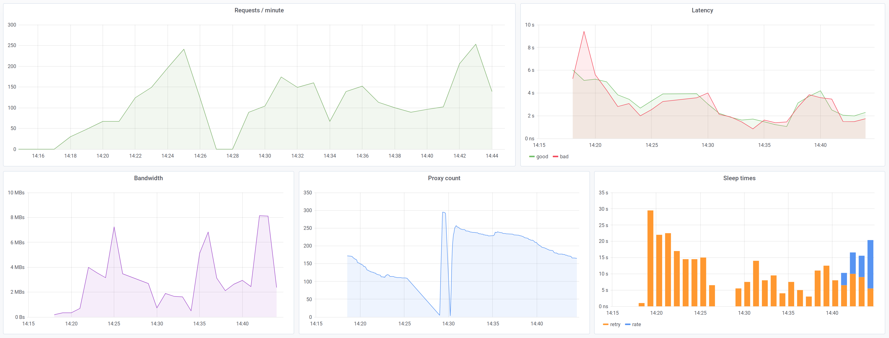

# Architeuthis 🦑

[](https://www.codefactor.io/repository/github/simon987/architeuthis)

[](https://ci.simon987.net/job/architeuthis_builds/)

HTTP(S) proxy with integrated load-balancing, rate-limiting
and error handling. Built for automated web scraping.

* Strictly obeys configured rate-limiting for each IP & Host
* Seamless exponential backoff retries on timeout or error HTTP codes
* Requires no additional configuration for integration into existing programs
* Configurable per-host behavior
* Monitoring with InfluxDB



### Typical use case


### Usage

```bash
wget https://simon987.net/data/architeuthis/16_architeuthis.tar.gz
tar -xzf 16_architeuthis.tar.gz

vim config.json # Configure settings here
./architeuthis
```

You can add proxies using the `/add_proxy` API:

```bash
curl http://localhost:5050/add_proxy?url=<url>&name=<name>
```

Or automatically using Proxybroker:
```bash
python3 import_from_broker.py
```

### Example usage with wget
```bash
export http_proxy="http://localhost:5050"
# --no-check-certificates is necessary for https mitm
# You don't need to specify user-agent if it's already in your config.json
wget -m -np -c --no-check-certificate -R index.html* http http://ca.releases.ubuntu.com/
```

With `"every": "500ms"` and a single proxy, you should see
```
...
level=trace msg=Sleeping wait=414.324437ms
level=trace msg="Routing request" conns=0 proxy=p0 url="http://ca.releases.ubuntu.com/12.04/SHA1SUMS.gpg"
level=trace msg=Sleeping wait=435.166127ms
level=trace msg="Routing request" conns=0 proxy=p0 url="http://ca.releases.ubuntu.com/12.04/SHA256SUMS"
level=trace msg=Sleeping wait=438.657784ms
level=trace msg="Routing request" conns=0 proxy=p0 url="http://ca.releases.ubuntu.com/12.04/SHA256SUMS.gpg"
level=trace msg=Sleeping wait=457.06543ms
level=trace msg="Routing request" conns=0 proxy=p0 url="http://ca.releases.ubuntu.com/12.04/ubuntu-12.04.5-alternate-amd64.iso"
level=trace msg=Sleeping wait=433.394361ms
...
```

### Hot config reload

```bash
# Note: this will reset current rate limiters, if there are many active
# connections, this might cause a small request spike and go over
# the rate limits.
./reload.sh
```

### Rules


Conditions

| Left operand | Description | Allowed operators | Right operand
| :--- | :--- | :--- | :---
| body | Contents of the response | `=`, `!=` | String w/ wildcard
| body | Contents of the response | `<`, `>` | float
| status | HTTP response code | `=`, `!=` | String w/ wildcard
| status | HTTP response code | `<`, `>` | float
| response_time | HTTP response code | `<`, `>` | duration (e.g. `20s`)
| header:`<header>` | Response header | `=`, `!=` | String w/ wildcard
| header:`<header>` | Response header | `<`, `>` | float

Note that `response_time` can never be higher than the configured `timeout` value.

Examples:

```json
[
  {"condition":  "header:X-Test>10", "action":  "..."},
  {"condition":  "body=*Try again in a few minutes*", "action":  "..."},
  {"condition":  "response_time>10s", "action":  "..."},
  {"condition":  "status>500", "action":  "..."},
  {"condition":  "status=404", "action":  "..."},
  {"condition":  "status=40*", "action":  "..."}
]
```

Actions

| Action | Description
| :--- | :--- |
| should_retry | Override default retry behavior for http errors (by default it retries on 403,408,429,444,499,>500)
| force_retry | Always retry (Up to retries_hard times)
| dont_retry | Immediately stop retrying

In the event of a temporary network error, `should_retry` is ignored (it will always retry unless `dont_retry` is set)

Note that having too many rules for one host might negatively impact performance (especially the `body` condition for large requests)


### Sample configuration

```json
{
  "addr": "localhost:5050",
  "timeout": "15s",
  "wait": "4s",
  "multiplier": 2.5,
  "retries": 3,
  "hosts": [
    {
      "host": "*",
      "every": "500ms",
      "burst": 25,
      "headers": {
        "User-Agent": "Some user agent for all requests",
        "X-Test": "Will be overwritten"
      }
    },
    {
      "host": "*.reddit.com",
      "every": "2s",
      "burst": 2,
      "headers": {
        "X-Test": "Will overwrite default"
      }
    },
    {
      "host": ".s3.amazonaws.com",
      "every": "2s",
      "burst": 30,
      "rules": [
        {"condition": "status=403", "action": "dont_retry"}
      ]
    }
  ]
}
```

